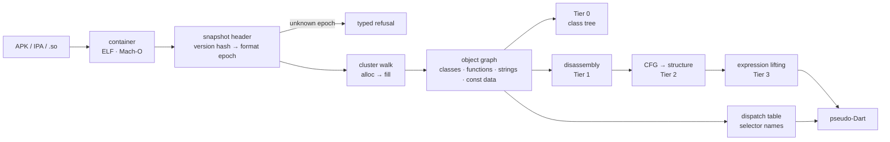

# Jadart

[](LICENSE)
[](#install)
[](#tests)

**A Flutter decompiler.** Point it at an APK and get back a class tree, method bodies as
pseudo-Dart, the string pool, embedded data tables, and the source names of virtual calls.

It is for reverse engineers, security reviewers, and anyone auditing a shipped Flutter app
who has hit the wall where most tools stop at ARM64 assembly.

Flutter compiles Dart ahead of time. There is no bytecode and no reflection metadata, so
teams ship banking, fintech, health and identity logic on the assumption that AOT hides it.
It does not. The public toolchain is simply fragmented, version-fragile, and stops at
assembly.

**The rule that shapes everything here: Jadart never prints a confident guess.** An
instruction it does not model prints as raw arm64. A call argument it cannot reconstruct
prints `(...)`. A field whose name is not in the binary prints `field_0x8`. A Dart release
whose format is not registered raises a typed error instead of parsing with a grammar that
might be wrong. Gaps are visible on purpose, because a plausible wrong answer is worse than
a marked absence.

## Showcase

<table>
<tr><th>original Dart</th><th><code>jadart decompile libapp.so LicenseVault</code></th></tr>
<tr><td>

```dart
class LicenseVault {
  int balance = 1000;

  bool withdraw(int amount) {
    if (amount > balance) return false;
    balance -= amount;
    return true;
  }

  int checksum(List<int> data) {
    int acc = 0;
    for (int i = 0;
         i < data.length; i++) {
      acc = (acc * 31 + data[i])
            & 0xffffffff;
    }
    return acc;
  }

  String classify(int score) {
    if (score < 0) return 'invalid';
    if (score < 40) return 'weak';
    if (score < 80) return 'fair';
    return 'strong';
  }
}
```

</td><td>

```dart
class LicenseVault {

  withdraw() {
    if (this.field_0x8 < 0xfa) {
      return false;
    } else {
      this.field_0x8 -= 250;
      return true;
    }
  }
  checksum() {
    while (true) {
      if (x4 >= x3) break;
      x0 = (x0 * 31 & 0xffffffff)
           + (x1[x4] & 0xffffffff)
           & 0xffffffff;
      x4 += 1;
    }
    return x0;
  }
  classify() {
    if ((x2 >> 63) & 1 != 0) {
      return "invalid";
    } else {
      if (x2 < 0x28) {
        return "weak";
      } else {
        if (x2 < 0x50) {
          return "fair";
        } else {
          return "strong";
        }
      }
    }
  }
}
```

</td></tr></table>

Each one shows a real property of the format:

- The string literals come back verbatim. `--obfuscate` does not encrypt them.
- `balance` renders as `this.field_0x8`, because THIS field's `Field` object did not
  survive: the string `balance` is not in the binary at all. Some fields do survive with
  their offsets and those are printed by name; see [Limits](#limits) for which and how many.
- `withdraw`'s parameter shows up as the constant `250`. The program's only call is
  `_vault.withdraw(250)`, so that is what the compiled code contains. Jadart shows you
  the compiled program, not the source you wish it were.
- The comparison flipped: `amount > balance` compiled to `balance < 250`, and Jadart
  prints what the branch actually tests.

## How it fits together



New to the format? [docs/how-flutter-works.md](docs/how-flutter-works.md) explains what a
Flutter app actually is on disk, how Dart gets compiled into it, and why that makes it hard
to read. [HOW-IT-WORKS.md](HOW-IT-WORKS.md) then walks the whole pipeline above end to end.

## Install

```bash
git clone https://github.com/IR0NBYTE/Jadart.git
pip install './Jadart/framework[disasm]'   # capstone is optional; the snapshot layer works without it
```

Python 3.9 or newer. The snapshot layer has no dependencies at all; `[disasm]` pulls in
capstone for the instruction-level commands.

## Quickstart

```bash
jadart info app.apk                        # is this Flutter, and is the format supported?
jadart verify app.apk                      # byte-exact gates: did the parse really work?
jadart classes app.apk -f Vault            # Tier 0 class, method and field tree
jadart decompile app.apk LicenseVault      # a whole class, as pseudo-Dart
jadart lift app.apk withdraw               # one function
jadart strings app.apk -g password         # the identifier and literal pool
jadart constants app.apk                   # embedded data tables, elements and all
jadart xrefs app.apk "some literal"        # who references it
jadart export app.apk out/                 # the whole browsable tree on disk
```

It takes an APK, a directory or a bare `libapp.so`. You do not unzip anything first, and
iOS builds work the same way (see [platform support](#platform-and-version-support)).

`-j` gives JSON on any command, errors included, so a caller never parses stderr.
Exit code is `0` on success, `1` when nothing in the binary matched what you asked for
or an acceptance gate failed, `2` when the input will not parse or the command line is
wrong, and `3` when jadart itself has a bug, which is never your file's fault.

Full walkthroughs: [docs/usage.md](docs/usage.md). Per-command help: `jadart <cmd> --help`.

## What it recovers, tier by tier

| tier | what you get | honest fallback |
|------|--------------|-----------------|
| 0 | class / method / field skeleton with the resolved superclass hierarchy (`FluBenchApp extends StatelessWidget`). 1843 named classes, 5756 members, 9013 strings on the clean corpus | classes whose names were stripped keep their structure |
| 1 | per-function arm64 with direct call targets named and ObjectPool constants resolved to their string or function, including far pool loads (`add xD, x27, #hi; ldr [xD, #lo]`) | unresolved pool slots print their raw offset |
| 2 | `if`/`else` and loops reconstructed as pseudo-Dart from the CFG, using forward and post-dominators, plus a Cifuentes follow node for the 36% of conditionals whose arms each end in their own `return` and so post-dominate at the virtual exit | 19.2% of functions still emit at least one `goto`, against 7.8% that are genuinely irreducible. `tools/cfgcheck.py` reads the structured tree back as a program and checks, for every block in the image, that the rendering claims exactly the successors the CFG has |
| 3 | expressions, by abstract interpretation over the register file: field load/store, arithmetic, `bool`/`null`/int constants, element access, compound `-=`, `return <expr>`, and scalar floating point (including int-to-double and double-to-int conversions, and `math.max`) | any instruction the lifter doesn't model prints as its arm64 line |
| 3.1 | call arguments from the callee's register arity, read at the target address and so not dependent on the callee having a recovered name (`benchWithdraw(t8, (x1.field_0x8 >> 1) ~/ 2)`). A call whose result is read gets that result named, so the value can be followed to its use | the stack convention, an arguments descriptor, and a target outside the image print `(...)` rather than a guess |
| 3.2 | VM runtime stubs rendered as source operations: `throw`, `throw NullCastError()`, `new List()`. Pure machinery is stripped so it never reaches output: frame setup, the stack-overflow check, the write barrier, type tests, and the Smi box-or-tag idiom, which surfaces as a bogus `if (x != x)` if you leave it in | anything else stays a named `bl` |
| 3.3 | virtual and interface calls attributed to a receiver plus a stable selector offset, `x1.sel_0xb34(...)`. About 74% of dispatch sites recover both | the rest print `(dynamic call)` |
| 3.4 | that offset resolved to a **source selector name**: `this.renderObject`, `x1.build(...)`. 168 selectors on the clean corpus, naming 28.7% of the dispatch sites that have a recovered offset | names need two agreeing classes AND an untied vote, so the rest keep `sel_0x<off>` |

Two things sit outside the tier ladder and matter a lot in practice.

**Full-image disassembly coverage.** Fixing the instruction-table walk to size a
function by the next table entry, across all entries rather than only recovered owners,
took obfuscated builds from 4% to 100% of the instruction image. Functions discarded by
`--obfuscate` keep their instructions and lose only their Code object.

**ELF and DWARF name backfill.** A default `flutter build --release` turns on
`dwarf_stack_traces_mode`, which strips Dart names out of the snapshot and emits them into
the ELF `.symtab` instead. Snapshot-only recovery on such a build yields short hash tokens
like `AB` and `Aba`. Jadart maps each recovered code range back to the covering symbol. On
a real third-party app that recovered **9666 real function names** the snapshot no longer
held, alongside 7225 string literals and 100% disassembly coverage over 11052 ranges. This
needs a `.so` that still has a symbol table: an unstripped build intermediate, a debug
`.so`, or a matching `--split-debug-info` file. A fully stripped shipped `.so` loses those
names for every tool.

Selector naming is not a heuristic. A method defined in class `C` occupies `C`'s own
dispatch row, so `selector_offset = k - cid(C)`, and every class defining that same
selector must independently produce the same number. On the corpus `get:hashCode` is
corroborated by 127 distinct defining classes, `toString` by 67, `build` by 48,
`createState` by 46, `createRenderObject` by 42, `dispose` by 40. That is the whole
Flutter widget lifecycle, each at its own offset. A name needs at least two agreeing
classes, and an offset claimed by two different names is dropped.


## Platform and version support

| target | container | pointers | status |
|---|---|---|---|
| Android arm64 | ELF64 | compressed | supported, every applicable Tier-A gate |
| x86_64 (emulator, desktop) | ELF64 | compressed | supported; structure only |
| iOS / macOS arm64 | Mach-O 64 | uncompressed | supported, every applicable Tier-A gate |
| Android arm32 (`armeabi-v7a`) | ELF32 | uncompressed | Tiers 1 and 2 decode; Tier 3 refuses |

**Eighteen registered format epochs**, Dart 2.19.6 through 3.12.2, across fourteen grammar
families. Two are beta builds, because Flutter's beta channel pins a Dart release of its
own and an app published from it carries that hash forever. An unregistered release fails
loud with the hash and the command that would identify it.

Detail and reasoning: [docs/support.md](docs/support.md).

## Why "it parsed" is not evidence

A snapshot parser that guesses wrong does not crash. It produces a plausible, entirely
fictional object graph. So Jadart ships byte-exact acceptance gates: `jadart verify` walks
the clusters and checks each one ends exactly where the format says it must, cross-checks
recovered field offsets against the displacement the field's own implicit getter compiled
to, and refuses rather than reports when a check cannot be understood.

The gates run on the committed fixtures, alongside a determinism diff across two
`PYTHONHASHSEED` values and differential oracles that execute the printed pseudo-Dart
against an emulated CPU and compare it to the real one. `.github/workflows/tests.yml`
lists the full set; it is disabled, so run them yourself before a release.

The full evaluation, including the comparison against `unflutter`, Blutter, Ghidra and
radare2, is in [EVAL.md](EVAL.md).

## Limits

Everything below is measured, not assumed. Jadart fails loud rather than filling gaps with
plausible output.

**Original source is unrecoverable.** AOT discards the AST. The realistic target is typed,
named pseudo-Dart, and that is what Jadart aims at.

**Most instance field names are gone, and a minority are not.** This page said "gone,
permanently" until it was measured properly, and that was wrong in a way worth spelling
out. What is true: the `offset_in_words_to_field` table is empty across all 2350 classes
in the corpus, only 420 of the program's several-thousand fields keep a `Field` object at
all, and `balance` is absent from the entire string pool, so `BenchAccount.balance` really
is unrecoverable and renders `this.field_0x8`.

What is false is the generalisation that followed. Of those 420 `Field` objects 245 are
INSTANCE fields, not statics, and each records its own byte offset (`Smi::New(
Field::TargetOffsetOf(field))`, app_snapshot.cc:2238). Across the 44 cached third-party
apps it is 36,555 instance fields of 59,160. So Jadart prints the name where the snapshot
supplies one and the receiver's class is known, and the offset everywhere else:

```
$ jadart classes libapp.so -f PointerEvent

class PointerEvent extends ... {
  distance;      // @0x58 unboxed
  distanceMax;   // @0x60 unboxed
  transform;     // @0xa4
```

A field keeps its `Field` object when something still points at it: 162 of the corpus's
245 are the `data` of a surviving implicit getter, implicit setter, or field initializer.
Everything the optimiser inlined away is gone, which is why this reaches 12.6% of the
lines that carry a `this.field_0x` on the corpus binary, 17.1% on Hacki, 18.0% on
com.k.todo and 19.2% on Immich, and not all of them.

**Eighteen supported epochs today**, 2.19.6 through 3.12.2. This paragraph used to say
"one, and three more identified and refused"; that was true when it was written and stopped
being true without being updated, which is the failure mode a README has and a test does
not. Nothing is currently identified-but-refused (`versions._UNVALIDATED` is empty). One
hash found in the wild is still unplaced and is bracketed rather than guessed at: its
feature string dates it to a Dart 3.5.x-3.8.x dev build. Adding an epoch is a bounded task,
not an open question, because `verify` decides when it is right.

**Obfuscation removes the app's own names permanently.** `--obfuscate` removes about 43%
of snapshot objects, which are the identifier strings, so name recall from the binary
drops to roughly 2% for every tool. Jadart keeps 100% string-literal recall and 100%
disassembly coverage there, and selector naming degrades to roughly 1 name because the
corroboration vote needs identifiers to count. `dwarf_stack_traces_mode` builds also yield
about 1 selector: the `.symtab` still has the real names, but only 245 of 2175 Functions
keep the snapshot `Code` to owner-`Class` link the offset arithmetic needs. Both degrade
to the Tier 3.3 rendering, never to a guess. `--sigs` recovers the *library* half of that
loss from a reference build (see [Naming library code](docs/usage.md#naming-library-code-that-was-obfuscated-away));
the app's own functions stay anonymous, because no reference contains them.

**No UI.** Jadart is a CLI. A navigable viewer is on the roadmap, not in the box.

**Arguments and unmodelled instructions are marked, not invented.** Calls using the stack
convention print `(...)`. Any instruction the lifter doesn't model prints as arm64. The
whole annotate, strip, CFG, structure, lift pipeline runs with **zero exceptions over 9000
code ranges** across the clean build, the obfuscated build, and a real third-party app.


## Using it from a coding agent

Jadart is a CLI that prints text, so any agent that can run a shell command can drive it.
What an agent cannot do on its own is know when a gap in the output is deliberate, and
that is the failure worth preventing: shown `x1.sel_0xb34(...)`, the natural move is to
say what it "probably" does, which turns a careful analysis into a confident fabrication
carrying the authority of a byte-exact tool.

[`skills/flutter-reverse-engineering/`](skills/flutter-reverse-engineering/SKILL.md) is a
skill that teaches exactly that. It routes each question to the command that answers it,
and spends most of its length on how to read a gap.

**Claude Code.** Copy the directory into your skills folder and it loads on the next run:

```bash
cp -r skills/flutter-reverse-engineering ~/.claude/skills/     # every project
cp -r skills/flutter-reverse-engineering .claude/skills/       # just this one
```

Then ask for the work in your own words. "Audit this APK for hardcoded secrets" matches
the skill's description and it applies itself; `/flutter-reverse-engineering` invokes it
by name.

**Anything else.** The file is plain Markdown with a YAML header, and nothing in the body
is vendor-specific. Cursor, Copilot, Cline, OpenAI's Agents SDK and a hand-rolled tool loop
all take the same content, as a system prompt, a rule file, or whatever that runtime calls
its instructions. Point it at a binary and give the agent a shell.

The one thing to keep, whatever you paste it into, is the rule at the top: never fill in a
gap the tool deliberately left. Everything else is routing.

## Documentation

| document | what is in it |
|---|---|
| [docs/how-flutter-works.md](docs/how-flutter-works.md) | how a Flutter app is built and what ships, with diagrams |
| [HOW-IT-WORKS.md](HOW-IT-WORKS.md) | the whole Jadart pipeline, end to end |
| [docs/usage.md](docs/usage.md) | command walkthroughs |
| [docs/support.md](docs/support.md) | platform and version support in detail |
| [DESIGN.md](DESIGN.md) | the annotated Dart AOT snapshot format, cited to dart-lang/sdk |
| [EVAL.md](EVAL.md) | evaluation against existing tools, and the failure taxonomy |
| [skills/](skills/flutter-reverse-engineering/SKILL.md) | a portable Flutter reverse-engineering skill for coding agents |
| [CHANGELOG.md](CHANGELOG.md) | what changed, and what the version number covers |
| [CONTRIBUTING.md](CONTRIBUTING.md) | how to add an epoch, a grammar or a gate |

## Repository layout

```
framework/            jadart itself, plus its test suite
  jadart/             containers (elf, macho, container), the snapshot stream
                      (stream, versions, cids, cidtables, snapshot, clusters,
                      fillwalk, fill, fields, program, symbols), the decompiler
                      (disasm, cfg, expr, dispatch, callgraph, signatures, ir,
                      ssa, lower), the gates (verify), and the CLI (cli, console,
                      export, errors)
  tools/              gen_cids, gen_epoch, sdk_source, build_corpus, measure,
                      cfgcheck, irfuzz, appsweep, ctfbench, bench, quality, semdiff
  tests/test_core.py  validation against the FluBench corpus
flubench/             the controlled corpus: a labelled construct app and its harness
  app/                the Flutter app whose declared symbols are exact ground truth
  artifacts/          the arm64 fixtures, clean and --obfuscate
  corpus/             one build per distinct snapshot hash (regenerate, not committed)
docs/                 usage, support, and the Flutter internals explainer
```

## Tests

```bash
cd framework && python3 -m pytest tests -q     # 194 tests
./check.sh                                     # the suite, the gates, the measured claims
./check.sh --full                              # adds the CFG edge check and determinism
```

Some tests need something this repository does not ship: a multi-version corpus, an
`--obfuscate` build of another app, `unicorn` for the differential oracles. Those skip
with the reason named, and pytest reports them as skips rather than passes. On a fresh
clone with capstone installed, expect around 177 to run.

The arm64 FluBench fixtures, clean and `--obfuscate`, are committed, so a fresh clone runs
the suite with no Flutter install. Tests whose fixture is missing skip and say which one.
Rebuilding, or extending to more Dart versions, needs Flutter on `PATH`:

```bash
bash flubench/build.sh                          # the arm64 clean + obfuscated fixtures
python3 framework/tools/build_corpus.py --plan  # the multi-version hash table
```

`build_corpus.py` drives `frontend_server_aot` and `gen_snapshot` directly instead of
`flutter build apk`. Both ship inside every SDK, so a corpus build needs no Android
toolchain, no pinned JDK and no AGP.

## Contributing

Bug reports, new format epochs and new acceptance gates are all welcome. Start with
[CONTRIBUTING.md](CONTRIBUTING.md); the rule that matters most is that a claim arrives with
the measurement behind it.

## Licence

MIT. See [LICENSE](LICENSE).
