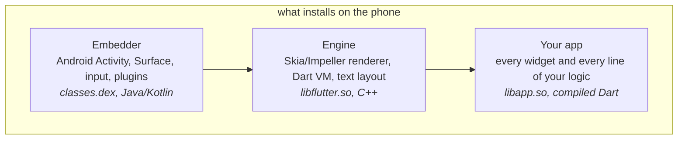
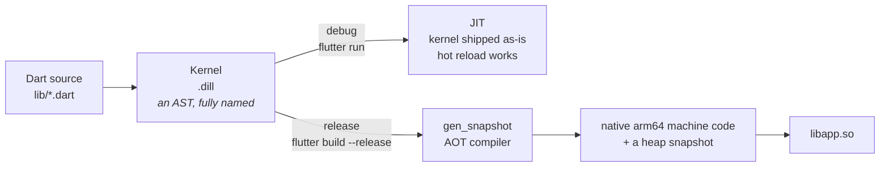
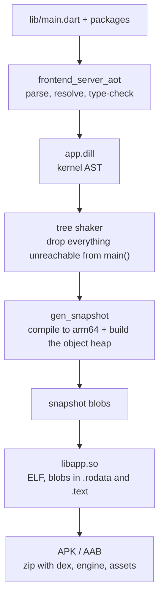
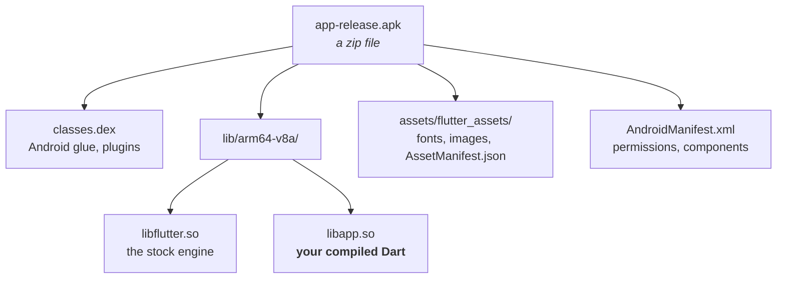
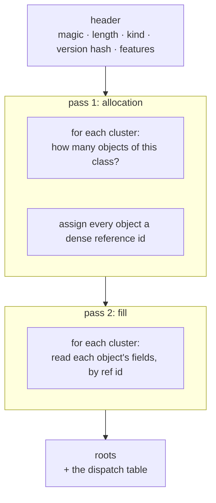
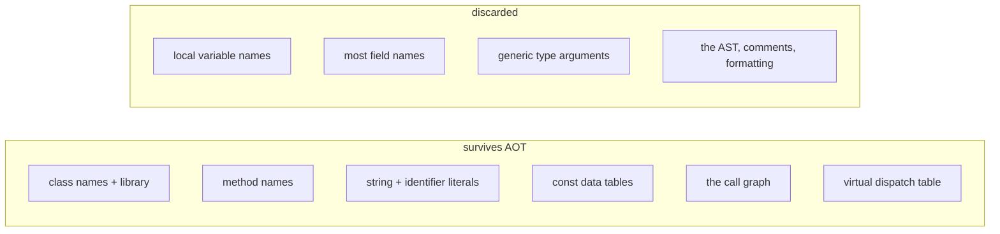
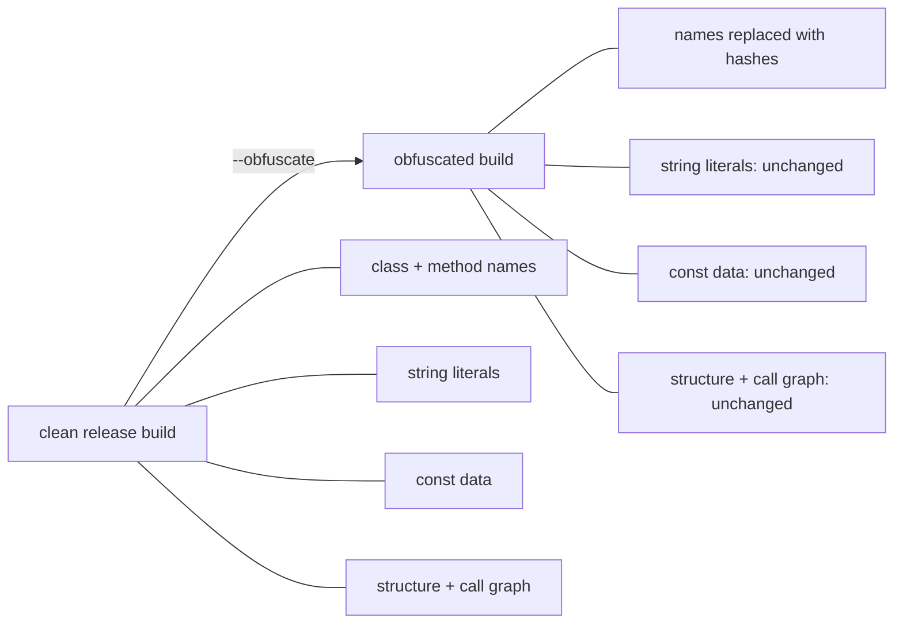
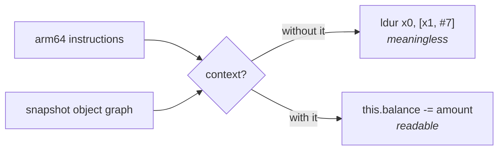

# How Flutter works, and why that makes it hard to read

This page is for someone holding a Flutter APK and wondering what is actually inside it.
No prior Dart knowledge assumed. By the end you should know what got compiled, what
survived, what was thrown away, and why the usual reverse engineering tools stop where
they do.

The follow-on page, [HOW-IT-WORKS.md](../HOW-IT-WORKS.md), covers what Jadart does about
each obstacle.

---

## 1. A Flutter app is three programs in a trench coat

Most mobile frameworks put your code on top of the platform's UI toolkit. Flutter does
not. It ships its own renderer and draws every pixel itself, which is why a Flutter app
looks identical on Android and iOS.

That means three separate things end up on the device:

For reverse engineering this split is the single most useful fact on the page:

- **`classes.dex`** is the Android side. `jadx` reads it. It holds the `Activity`, the
  plugin registrations, and any Java or Kotlin the app or its packages contributed.
- **`libflutter.so`** is the stock engine. It is the same binary for everyone on that
  Flutter version and contains none of the app's logic. Ignore it.
- **`libapp.so`** is the app. Every widget, every network call, every validation rule,
  every hardcoded secret. **This is the file that matters**, and it is the one no standard
  tool could read.

---

## 2. Dart compiles twice, and the second one is the problem

Dart runs in two completely different modes, and which one you get depends entirely on the
build type.

**Debug builds ship the kernel `.dill`**, which is a serialised syntax tree with every name
intact. Hot reload works because the VM can swap in new kernel at runtime. A debug build is
trivially readable, and this is why you occasionally find an APK that gives up everything
instantly: someone shipped a debug build.

**Release builds run `gen_snapshot`**, which compiles Dart all the way to native arm64 and
then serialises the resulting heap. There is no bytecode left, no AST, and no reflection
metadata. That is the artifact this whole project exists to read.

### The full release pipeline

Two steps in there destroy most of what a reader would want.

**Tree shaking** removes anything not reachable from `main()`. This is why a Flutter app
that imports a huge package ships almost none of it, and why you will not find a function
that the app never calls.

**Snapshotting** serialises the live object heap rather than a program description. What
gets written is the objects the VM needs at startup, not a record of the source that
produced them.

---

## 3. What actually lands in the APK

Inside `libapp.so`, four named blobs carry the program:

| symbol | what it holds |
|---|---|
| `_kDartVmSnapshotData` | VM-level objects shared by every isolate |
| `_kDartVmSnapshotInstructions` | VM-level machine code |
| `_kDartIsolateSnapshotData` | **the app's object graph**: classes, functions, strings, const data |
| `_kDartIsolateSnapshotInstructions` | **the app's machine code** |

The two isolate blobs are the target. `strings libapp.so` already reaches the literals in
the first one, which is why a hardcoded API key in a Flutter app is not hidden at all.
Everything harder lives in the structure around them.

---

## 4. Inside the snapshot: clusters

The isolate data blob is not a file format with an index you can seek around. It is a
**stream**, written in two passes, and it can only be read from the beginning.

A **cluster** is all the objects of one class, written together. The allocation pass says
how many there are and hands each a number; the fill pass then writes their contents. Every
pointer in the snapshot is one of those numbers.

This design has a consequence that dominates everything else about reading Flutter:

> **You cannot parse part of a snapshot.** Each cluster's reader consumes exactly the bytes
> that cluster wrote, and the next cluster starts wherever the previous one stopped. Get one
> field width wrong in one cluster and every byte after it is misinterpreted, silently.

And it gets worse, because the grammar is not stable. Dart's serialiser changes between
releases. A snapshot records a **version hash** identifying which VM wrote it, and reading
a 3.12 snapshot with a 3.0 grammar does not fail cleanly. It produces a complete,
confident, entirely fictional object graph.

That is why Jadart keys everything on the version hash and refuses to parse a release it
does not have a registered grammar for. A wrong answer here is far worse than no answer,
because nothing downstream looks broken.

---

## 5. What survives, and what does not

**Class and method names survive** because the VM needs them: for `toString()`, for stack
traces, for `runtimeType`. They are real strings in the data blob.

**Local variable names do not survive.** Locals became registers and stack slots. `amount`
is now `x2`, and no table anywhere maps it back. This is not a limitation of any tool; the
information is not present.

**Most field names do not survive, but a real minority do.** A `Field` object is kept when
something still points at it, typically a surviving implicit getter or setter, and it
records its own byte offset. Across 44 real apps that is about 36,555 instance fields of
59,160. Where the name is there, a good tool prints `this.balance`. Where it is not, the
honest rendering is `this.field_0x8`, because the offset is genuinely all that remains.

**Integers are tagged.** Dart stores small integers ("Smis") inline in the pointer with the
low bit clear, so machine code that looks like it is dividing a pointer by two is usually
just untagging an integer. Reading a snapshot without knowing this produces arithmetic that
looks wrong in a very specific and confusing way.

---

## 6. What `--obfuscate` does, and what it does not

`--obfuscate` renames identifiers. It removes roughly 43% of snapshot objects, because
those objects were the identifier strings.

It does **not** encrypt string literals, and it does **not** touch const data. So on an
obfuscated build you lose names and keep everything else: structure, string
cross-references, the call graph, and every embedded table.

In practice that is usually enough. If an app derives a secret at runtime instead of
storing it as a literal, the constants that drive the derivation are still sitting in the
binary as a const list, and the arithmetic that consumes them is still readable as code.
Recovering it is a matter of reading, not guessing.

There is one more wrinkle worth knowing. A default release build also enables
`dwarf_stack_traces_mode`, which moves Dart names out of the snapshot and into the ELF
symbol table. If you have an unstripped `.so`, those names are recoverable from `.symtab`
even though the snapshot no longer holds them. A fully stripped shipped `.so` loses them
for every tool.

---

## 7. Why the standard tools stop

| tool | what it does with `libapp.so` | where it stops |
|---|---|---|
| `strings` | finds literals immediately | no structure, no logic |
| `jadx` | reads `classes.dex` perfectly | never touches the Dart |
| `radare2` / Ghidra | disassembles arm64 | no function boundaries, no names, no Dart ABI awareness |
| a generic decompiler | C-like pseudocode from assembly | no notion of Smis, object pool, or the register roles |

The gap is not that arm64 is hard. It is that everything which makes the machine code
meaningful lives in the **snapshot**, not the instruction stream:

- which register holds the thread, the object pool, the null singleton
- which function each code range belongs to
- what a given pool offset resolves to
- what a dispatch offset means as a method name

Recover the object graph and the assembly becomes readable. Skip it and you are reading
arm64 with no context, forever.

---

## 8. Where to go next

- **Use the tool:** [../README.md](../README.md), then [usage.md](usage.md).
- **The pipeline in detail:** [../HOW-IT-WORKS.md](../HOW-IT-WORKS.md).
- **The format itself, cited to dart-lang/sdk:** [../DESIGN.md](../DESIGN.md).
- **Working with a coding agent:** [../skills/flutter-reverse-engineering/SKILL.md](../skills/flutter-reverse-engineering/SKILL.md) is a portable Flutter RE skill
  whose central rule is the one this page keeps circling: report the gaps, never fill them.

A deeper companion covering the engine internals and the Android intersection, with a
hands-on challenge at the end, is in progress.
